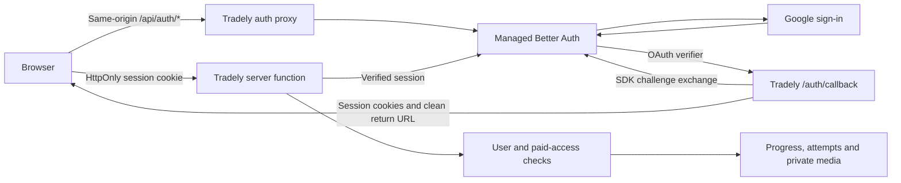

# Tradely authentication

Tradely uses Neon's Managed Better Auth with Google OAuth and email verification
codes. Both choices sign in returning learners or create a verified account.
Google OAuth credentials are configured in Neon, never in the browser bundle.
Only verified email identities can access identity-dependent server functions.

## Ownership and request flow

The `@neondatabase/auth` SDK is pinned to `0.5.0-beta`. Its framework-independent
server toolkit is adapted to TanStack Start in `apps/web/src/auth/neon.server.ts`.
The application does not implement session cryptography.



- Browser auth API calls go through `/api/auth/*`. OAuth redirects also visit
  Google and Neon to complete the provider handshake.
- Google sign-in sends existing-user, new-user, and error callbacks to the
  same-origin `/auth/callback` endpoint. It uses the SDK's
  `processAuthMiddleware` to validate the browser challenge and exchange the
  verifier before rendering any page. The redirect preserves every SDK session
  and challenge-cleanup cookie. Only sanitized application paths are accepted
  as `returnTo`; cancellation and failure show a fixed retry message.
- Callback responses are `private, no-store` with `Referrer-Policy: no-referrer`.
  OAuth verifiers and provider errors are stripped before page rendering and
  analytics initialization. Google sign-in grants no paid access by itself.
- The SDK filters cookies, signs its session-data cache, and rewrites cookies
  with `Secure`, `HttpOnly` where emitted by Neon, and `SameSite=Lax`. Lax keeps
  sign-in available on top-level returns from Stripe and email clients.
- The server rejects auth POST requests whose Origin is not the request's own
  origin, and rejects cross-site fetches before contacting Neon.
- User identity comes from the verified server session, never a submitted ID.
  Anonymous requests do not contact the auth upstream. Authentication outages
  fail closed. The signed session-data cache has a 60-second lifetime.
- Billing and access remain application-owned. Neither a valid login nor a
  client-rendered paywall grants a course pass. Stripe Customers and Checkout
  metadata now reference `user_id` / `tradely_user_id`.
- The app uses server-side Drizzle queries; it does not enable direct browser
  access to the database or change the database's RLS policy.

## Environment configuration

Use the two original branches in Neon project `winter-fire-23212462`:

| Neon branch | Branch ID | Application environment |
| --- | --- | --- |
| `production` (default) | `br-young-night-afo4dv8d` | Vercel Production |
| `test` | `br-muddy-credit-afua0u9c` | Vercel Preview and local development |

Each branch contains both Managed Better Auth's `neon_auth` schema and the
application's `public` tables for learner profiles, progress, and attempts.
Separate branches for authentication are unnecessary. Enable and verify Auth
on the branch itself; an empty `neon_auth` schema alone does not establish a
working Auth integration. Never connect Preview to the production learner
database or Stripe live credentials. Preview checkout remains disabled until
dedicated Stripe test credentials are set.

Set these per Vercel environment:

| Variable | Purpose |
| --- | --- |
| `VITE_AUTH_ENABLED=true` | Expose the sign-in interface |
| `NEON_AUTH_BASE_URL` | The branch's Auth URL, ending in `/neondb/auth` for the default database |
| `NEON_AUTH_COOKIE_SECRET` | An independently generated random secret of at least 32 characters |
| `DATABASE_URL` | The matching branch's database connection string |

Set the cookie secret as a sensitive Vercel variable. Never commit it. Local
`.env` values use the `test` branch; production builds reject missing
authentication configuration. `VITE_AUTH_ENABLED=false` is a local public-preview
mode, and hides account controls.

In Neon Auth configuration:

1. Enable the email OTP plugin with six-digit codes and sign-up enabled.
2. Require email verification and enable verification emails on both sign-up
   and sign-in. Hosted returning-user OTP delivery was verified with both
   settings enabled. The application independently rejects unverified
   identities on every identity-dependent server call.
3. Configure a custom SMTP sender for production email delivery. Neon's shared
   sender is for development/testing and is rate-limited.
4. Allow only the applicable origins. Production requires `https://tradely.ai`
   and `https://www.tradely.ai`; preview origins belong to Preview's branch.
5. Disable localhost access on `production`. Allow it on `test`.
6. Set the user-facing application name to Tradely.

See [Neon production configuration](https://neon.com/docs/auth/production-checklist)
and the SDK's `BUILDING-AN-ADAPTER.md`. Managed Better Auth is currently beta;
review the SDK changelog before upgrading the pinned server toolkit.

## Google OAuth configuration

Google's shared testing provider is enabled on both `production` and `test`.
The owner approved continuing with these credentials while Tradely is prelaunch.
Google's consent screen therefore identifies `neon.tech`. Public launch requires
custom Google OAuth clients and Tradely consent-screen branding in Google Cloud.

For custom clients, use the **Web application** client type and register the
matching provider redirect URI:

| Neon branch | Google authorized redirect URI |
| --- | --- |
| `production` | `https://ep-quiet-rain-afp8bmfg.neonauth.c-2.us-west-2.aws.neon.tech/neondb/auth/callback/google` |
| `test` | `https://ep-wandering-field-afm7brbp.neonauth.c-2.us-west-2.aws.neon.tech/neondb/auth/callback/google` |

These are Google's callbacks to Neon. The application's `/auth/callback` is the
subsequent return from Neon to Tradely. Keep application origins in the matching
Neon branch's trusted domains. Enter each Client ID and Client Secret in that
branch's Auth configuration; no additional Vercel Google secret is needed.

See [Neon's OAuth setup guide](https://neon.com/docs/auth/guides/setup-oauth).
The button uses Google's official
[G asset](https://developers.google.com/static/identity/images/g-logo.png),
served locally as `/google-g.png`.

## Prelaunch database reset

The project owner explicitly authorized a fresh start: there are no real users
or purchases to migrate. `0003_neon_auth_fresh_start.sql` empties only the
application's `app_user`, `lesson_progress`, and `lesson_attempt` tables and
renames their identity columns to `user_id`. Historical migrations remain so
an existing deployment can apply the cutover once through Drizzle's journal.

Do not run this reset against another product's database. It does not delete
Stripe objects, other databases, media, or authentication-provider applications.
Apply all migrations on the isolated target branch before routing the migrated
application to it. The previous deployment and database branch provide rollback
until the new flow has been verified.

## Release checks

Run type checks, web tests, database script tests, and the production build
under Node 24. The test suite checks origin rejection, safe return URLs,
request-local cookie handling, verified identity, and the data reset plus
foreign-key behavior using isolated PostgreSQL.

Verify in a real browser against the configured Preview Neon branch:

- Email code delivery, invalid/expired codes, resend cooldown, and a successful
  code verification that returns to the originating lesson or pricing page.
- Session persistence after reload and return from checkout; logout must remove
  paid content and prevent further progress updates.
- A new account has no paid grant. A valid test purchase unlocks only its own
  account; restore and revocation still require the exact Customer, Checkout
  Session, configured Price and entitlement.
- Progress saves/resumes only for the authenticated account; another account
  cannot read or mutate those records.
- Auth responses are never cached by intermediaries; email addresses, codes, cookies,
  user UUIDs in diagnostic text, and upstream errors do not enter analytics.

Only then set Production's Auth URL, cookie secret and matching database URL,
build and deploy, and repeat the sign-in/reload/logout and denied-access checks.
Remove obsolete hosting environment variables after the new deployment is
verified. A successful build or mocked SDK test is not proof of email delivery
or live authentication.

## Manual Vercel releases

Git-triggered builds receive `VERCEL_GIT_COMMIT_SHA`. CLI releases must supply
the release identifier explicitly for the existing PostHog build gate and
matching runtime diagnostics. Run from the isolated, committed release checkout:

```bash
release="$(git rev-parse HEAD)"
vercel deploy --prod --build-env "VITE_APP_RELEASE=$release" --env "VITE_APP_RELEASE=$release"
```

Use a new production build with Production environment variables. Promoting a
Preview build would retain its Preview database and authentication configuration.

## Verified prelaunch cutover — September 8, 2026

This historical rollout used temporary branches. The September 9 consolidation
below supersedes its branch mapping and rollback availability.

- Neon project: `winter-fire-23212462` (Tradely AI, FLOWMAN LLC).
- Production/default branch: `neon-auth-production` (`br-withered-wind-afyejyfy`).
- Preview branch: `neon-auth-preview` (`br-solitary-frog-afgk8fxl`).
- Live application: https://www.tradely.ai/auth/sign-in.
- Auth-only code release: `bc8350b73678d1dad556a60c54fec5bf8045fc58`.
- Final production deployment: `dpl_ANgcuTqqTPnbgib2AbRKwrCLnyxb`.
- The isolated release passed 331 web tests, 6 database-script tests, type
  checking, scoped Biome checks, and a Node 24 production build. The full
  repository Biome command remains blocked by pre-existing `site-static` errors.
- Real email-code delivery, invalid-code rejection, new and returning sign-in,
  signed cookies, saved progress across reloads, unpaid access denial, and logout
  were exercised across local and hosted Preview. Production independently passed
  registration, session/progress persistence, unpaid denial, logout, and
  cross-origin auth POST rejection (403 with private/no-store caching).
- Desktop and mobile sign-in layouts were inspected; mobile had no horizontal
  overflow. The live page loaded no Clerk scripts or development-mode badge.
- Production and Preview use separate Auth URLs, database branches, and session
  cookie secrets. All Clerk project environment variables were removed and
  production was rebuilt afterward. Verification accounts and progress were
  removed from both new branches; each had zero auth users after cleanup.
- The project is still prelaunch. The Neon shared email sender is active;
  configure a dedicated SMTP sender before public launch. Verification email on
  sign-in must remain enabled for the tested returning-user code flow.
- Previous database branches remain available for rollback. The auth-only
  release excludes the concurrent local PostHog implementation commit, which was
  not part of this deployment. Commits remain local; no Git push was performed.

## Verified branch consolidation — September 9, 2026

- Restored the original `production` and `test` branches shown in the environment
  table above. `production` is the project default. Each environment uses its own
  branch for both authentication and application data.
- Both temporary `neon-auth-*` branches had zero users, sessions, profiles,
  progress, and attempts before removal. No post-cutover records needed moving.
  The original `test` branch's 14 legacy Clerk test profiles and one progress row
  were cleared under the owner's approved prelaunch fresh start. Both original
  branches have the current migrations and `user_id` identity columns; their
  working Managed Better Auth integrations were preserved.
- Updated Vercel Production and Preview database URLs, matching Auth URLs, and
  independent sensitive cookie secrets. Local `apps/web/.env` now uses `test`.
  Cookie rotation requires signing in again. Production allows the two Tradely
  origins and rejects localhost; `test` allows localhost and the exact verified
  Preview origin.
- Rebuilt the existing live code release
  `3789a59eeee76f640e738cb1591a96d8516794af` with the new environment settings:
  Preview `dpl_BhnoJbJsu9NPRCRSa5Qbjdszkk7J`, Production
  `dpl_6ofJ1D7z84LYYBQ4uYubZtPMvEjF`. Both reached READY; Production serves
  `tradely.ai` and `www.tradely.ai`.
- Verified real email-code registration, saved lesson progress across a reload,
  and logout in both environments. Database readback confirmed each verified
  identity and completed lesson in its corresponding original branch. Returning
  sign-in also passed on Preview. Production denied unpaid access and rejected
  a foreign-origin auth POST with 403. Preview blocks paid content while its
  Stripe test credentials remain unconfigured. Auth session responses use
  `private, no-store`; the live page loads no Clerk scripts.
- The two targeted migration and auth test files passed all 12 tests. Removed
  only the verification identities and their application records after testing.
  All four branches were empty of users and application records at cleanup.
- Deleted `neon-auth-production` and `neon-auth-preview` after verification and
  confirmed only the two original branches remain. Older deployments that embed
  deleted branch URLs must be rebuilt with the current environment bindings;
  those branches are no longer rollback targets.
- The shared Neon email sender remains active for prelaunch testing. Dedicated
  production SMTP and Preview Stripe test credentials remain separate launch
  setup. This consolidation changed infrastructure and documentation; it did not
  deploy newer local application commits or push Git changes.

## Verified Google sign-in release — September 9, 2026

- Implementation commit: `4106599` (`feat(auth): add Google sign-in through Neon OAuth`).
- Preview deployment: `dpl_FTwDZJgE4F891ZvAfJjcxJcUYhpz`, using `test`.
- Production deployment: `dpl_5vY9u1wFhynbGN7gp5zfgUY4EUVU`, serving
  `tradely.ai` and `www.tradely.ai` using `production`. Both builds reached READY.
- Local validation passed all 347 web tests, type checks, scoped Biome checks,
  and `git diff --check`. Callback tests use the real Neon server toolkit with
  an isolated upstream to exercise challenge validation, signed cookies, unsafe
  return paths, cancellation, and upstream failures. Desktop and 390px mobile
  sign-in pages rendered correctly with no horizontal overflow or error overlay.
- Real Google sign-in passed locally, on Preview, and on Production. Production
  exercised a new Google account; Preview exercised returning sign-in. Both
  hosted environments returned to the requested lesson without an OAuth verifier
  in the final URL and retained the session and saved progress after reload.
  Database reads confirmed verified Google identities and progress in the
  matching original branches.
- Production also passed unpaid lesson denial, logout, and email-code sign-in
  to the same Google-linked account with its existing progress. A foreign-origin
  social sign-in POST returned 403; a cancelled callback returned a clean retry
  URL with `private, no-store` and `Referrer-Policy: no-referrer`.
- Retained the owner's Google identities and removed only the lesson-completion
  records created during verification. No purchases or paid grants were made.
  The two original branches and the approved shared Google provider remain in
  use. Deployment used a clean checkout and environment-specific Vercel builds;
  no Git push was performed for this release.
