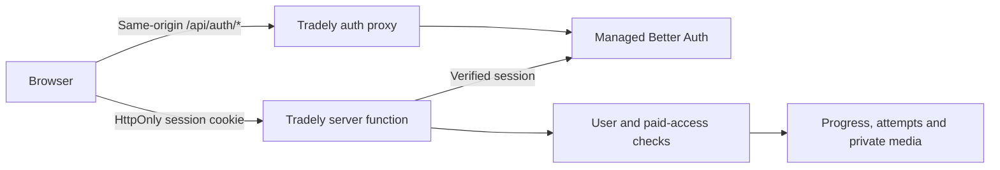

# Tradely authentication

Tradely uses Neon's Managed Better Auth with email verification codes. The same
form signs in returning learners and creates a new account after an email code
is verified. No password or social-provider credentials are required by this UI.
Only verified email identities can access identity-dependent server functions.

## Ownership and request flow

The `@neondatabase/auth` SDK is pinned to `0.5.0-beta`. Its framework-independent
server toolkit is adapted to TanStack Start in `apps/web/src/auth/neon.server.ts`.
The application does not implement session cryptography.



- The browser calls `/api/auth/*`; the upstream Neon Auth URL stays server-side.
- The SDK filters cookies, signs its session-data cache, and rewrites cookies
  with `Secure`, `HttpOnly` where emitted by Neon, and `SameSite=Lax`. Lax keeps
  sign-in available on top-level returns from Stripe and email clients.
- The server rejects auth POST requests whose Origin is not the request's own
  origin, and rejects cross-site fetches before contacting Neon.
- User identity comes from the verified server session, never a submitted ID.
  Anonymous requests do not contact the auth upstream. Authentication outages
  fail closed. The signed session-data cache has a 60-second lifetime.
- Billing and access remain application-owned. Neither a valid login nor a
  client-rendered paywall grants a course pass. Stripe Customers and Checkout
  metadata now reference `user_id` / `tradely_user_id`.
- The app uses server-side Drizzle queries; it does not enable direct browser
  access to the database or change the database's RLS policy.

## Environment configuration

Enable Auth on separate Tradely Neon branches for Production and Preview.
For this prelaunch cutover, create standard child branches of the existing
working Auth branch and clear copied test accounts after applying migrations.
Schema-only copies can retain an empty `neon_auth` schema without a working
Auth integration; they are not used for this release. Never connect Preview
to the production learner database or Stripe live credentials. Preview
checkout remains disabled until dedicated Stripe test credentials are set.

Set these per Vercel environment:

| Variable | Purpose |
| --- | --- |
| `VITE_AUTH_ENABLED=true` | Expose the sign-in interface |
| `NEON_AUTH_BASE_URL` | The branch's Auth URL, ending in `/neondb/auth` for the default database |
| `NEON_AUTH_COOKIE_SECRET` | An independently generated random secret of at least 32 characters |
| `DATABASE_URL` | The matching branch's database connection string |

Set the cookie secret as a sensitive Vercel variable. Never commit it. Local
`.env` values may use a development branch; production builds reject missing
authentication configuration. `VITE_AUTH_ENABLED=false` is a local public-preview
mode, and hides account controls.

In Neon Auth configuration:

1. Enable the email OTP plugin with six-digit codes and sign-up enabled.
2. Require email verification and enable verification emails on both sign-up
   and sign-in. Hosted returning-user OTP delivery was verified with both
   settings enabled. The application independently rejects unverified
   identities on every identity-dependent server call.
3. Configure a custom SMTP sender for production email delivery. Neon's shared
   sender is for development/testing and is rate-limited.
4. Allow only the applicable origins. Production requires `https://tradely.ai`
   and `https://www.tradely.ai`; preview origins belong to Preview's branch.
5. Disable localhost access on Production. Allow it on the development branch.
6. Set the user-facing application name to Tradely.

See [Neon production configuration](https://neon.com/docs/auth/production-checklist)
and the SDK's `BUILDING-AN-ADAPTER.md`. Managed Better Auth is currently beta;
review the SDK changelog before upgrading the pinned server toolkit.

## Prelaunch database reset

The project owner explicitly authorized a fresh start: there are no real users
or purchases to migrate. `0003_neon_auth_fresh_start.sql` empties only the
application's `app_user`, `lesson_progress`, and `lesson_attempt` tables and
renames their identity columns to `user_id`. Historical migrations remain so
an existing deployment can apply the cutover once through Drizzle's journal.

Do not run this reset against another product's database. It does not delete
Stripe objects, other databases, media, or authentication-provider applications.
Apply all migrations on the isolated target branch before routing the migrated
application to it. The previous deployment and database branch provide rollback
until the new flow has been verified.

## Release checks

Run type checks, web tests, database script tests, and the production build
under Node 24. The test suite checks origin rejection, safe return URLs,
request-local cookie handling, verified identity, and the data reset plus
foreign-key behavior using isolated PostgreSQL.

Verify in a real browser against the configured Preview Neon branch:

- Email code delivery, invalid/expired codes, resend cooldown, and a successful
  code verification that returns to the originating lesson or pricing page.
- Session persistence after reload and return from checkout; logout must remove
  paid content and prevent further progress updates.
- A new account has no paid grant. A valid test purchase unlocks only its own
  account; restore and revocation still require the exact Customer, Checkout
  Session, configured Price and entitlement.
- Progress saves/resumes only for the authenticated account; another account
  cannot read or mutate those records.
- Auth responses are never cached by intermediaries; email addresses, codes, cookies,
  user UUIDs in diagnostic text, and upstream errors do not enter analytics.

Only then set Production's Auth URL, cookie secret and matching database URL,
build and deploy, and repeat the sign-in/reload/logout and denied-access checks.
Remove obsolete hosting environment variables after the new deployment is
verified. A successful build or mocked SDK test is not proof of email delivery
or live authentication.

## Manual Vercel releases

Git-triggered builds receive `VERCEL_GIT_COMMIT_SHA`. CLI releases must supply
the release identifier explicitly for the existing PostHog build gate and
matching runtime diagnostics. Run from the isolated, committed release checkout:

```bash
release="$(git rev-parse HEAD)"
vercel deploy --prod --build-env "VITE_APP_RELEASE=$release" --env "VITE_APP_RELEASE=$release"
```

Use a new production build with Production environment variables. Promoting a
Preview build would retain its Preview database and authentication configuration.
