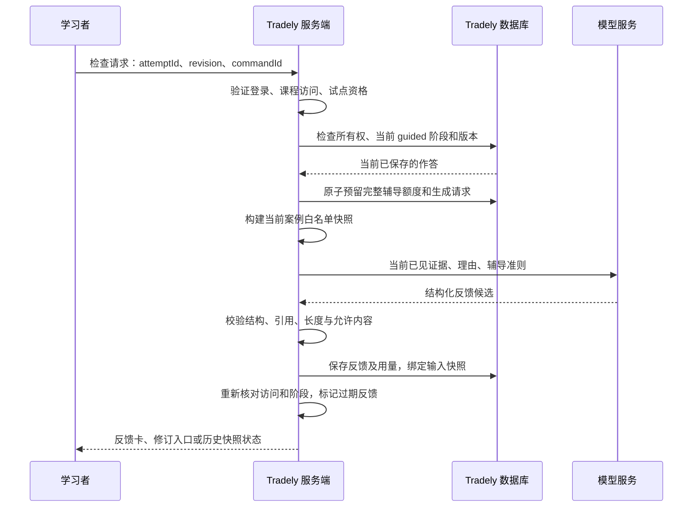

# Tradely AI 练习教练：代码改动计划

状态：待实施。本文件是产品与代码计划，不表示功能已经实现或上线。

日期：2026-09-09。代码参考基线：`5de42c1`，另核对了规划期间的工作区内容。实施前重新检查 HEAD、未提交修改与依赖版本；不得覆盖并行任务的改动。

## 1. 产品目标与第一版范围

把现有引导练习变成一次完整的辅导：**先作答并写理由 → 检查我的判断 → 找到证据缺口 → 修改理由 → 用不同案例独立验证。**

**设计声明：教练模块拥有某次练习的解释快照、形成性反馈与修订记录；现有 learning 域继续拥有案例、作答、独立评分和学习结果，AI 不直接修改这些结果。**

定位为“帮助学习者形成可检验的期权研究判断”。本轮验证的是反馈是否有用、学习者是否改善并愿意回来；不以聊天量、盈亏或 AI 给出的分数证明掌握。

第一版默认决定：

- 在课程练习内部提供辅导卡，不新增全站聊天页。
- 首先开放三课：`audited-boundary`、`rank-symbols`、`rank-contracts`。
- AI 仅在当前 **guided / answer** 阶段可调用；独立案例答题过程中不提供 AI 答案或反馈。现有静态 hint 仍遵守原来的 hint 记录与评分规则。
- 每次辅导包含两次生成：首次反馈、修订后反馈。中间的“给我提示”复用经过审核的本课提示，不额外调用模型。
- 真实 AI 试点面向登录且获准参加的用户；匿名用户保留当前免费练习。首次启动要求保存到当前账户的练习，不能把匿名动作列表直接当作可信账户记录。
- 试点复用课程访问权，暂不新增 Stripe 商品。免费课用户每天可开始 1 次完整辅导；有完整课程访问权的用户每天 3 次，均以服务端 UTC 日为准。此额度是试点默认值，不是长期套餐承诺。
- 中英文同时支持，采用现有 UI 组件与无障碍规范。

后续阶段再考虑：独立案例提交后的研究稿复盘、跨课薄弱项汇总、个性化下一题、语音口述。第一版不引入实盘账户、交易信号、自动交易、市场新闻检索、向量数据库或自主工具执行。

## 2. 研究如何转成代码决定

以下为公开产品资料支持的交互参考，不是竞品实测效果或用户需求证明。

| 研究参考 | 采用的产品原则 | 对应代码决定 |
| --- | --- | --- |
| [OptionsPractice](https://optionspractice.com/)：练习题中的即时反馈与 AI 辅导 | 先有一个具体学习任务 | 教练挂在现有 guided 题组之后；必须先保存答案 |
| [TraderSync Cypher](https://tradersync.com/cypher/)：围绕个人交易与计划解释表现 | 反馈紧邻证据 | 反馈引用本案例的行、字段或教学片段；点引用回到对应位置 |
| [TradeZella](https://help.tradezella.com/en/articles/11201153-what-is-zella-ai-tradezella-s-ai-trading-assistant)：结合日志、规则和当前场景 | 背景来自用户自己的工作 | 服务器读取所属 attempt；保存“原理由—反馈—修订” |
| [Khanmigo](https://www.khanmigo.ai/learners)：提示与追问 | 给可执行的下一步 | 每轮只聚焦一个最重要缺口和一个追问，并允许查看提示 |
| [Duolingo](https://blog.duolingo.com/ai-and-video-call/)：有起止的练习 | 教练活动可完成 | 两轮反馈后转入现有独立案例，显示本轮完成状态 |
| [OptionsCoach](https://options-coach.com/)：交易理由、反馈与进步的定位 | 理由与修订有长期价值 | 保留修订证据；其 Pro 教练仍标 Coming Soon，不以此证明商业模式 |

## 3. 当前代码事实及需要补齐的部分

| 当前实现 | 对计划的影响 |
| --- | --- |
| `content/syllabus.ts` 与 `course.ts` 已组成 8 模块、36 节课程；当前版本为交互内容优先，`mediaCurrent: false` | 教练以案例和课程片段为上下文，不依赖视频时间戳或旧视频逐字稿 |
| `content/units/*.server.ts` 是现行教学内容；`content/scenarios/index.server.ts` 同时保留旧版案例用于历史记录 | 扩展现行教学单元；不能误改旧版 scenario 当作当前课程 |
| `unitScenarios()` 提供两个 practice 变体；第三个 evaluation 变体不进入运行时注册表 | 第一版复用已有 guided → independent 流程；离线评估集继续隔离 |
| `lesson_attempt` 保存 state、revision、hint、不可变 submitted assessment | 复用保存、所有权和并发机制；辅导历史单独持久化 |
| `engine.ts` 的文字题只有完整性检查，`reviewRequired` 不会自动变成掌握 | AI 反馈不清除 `unreviewed`，不赋予 `demonstrated` |
| `transitionAttempt()` 在 guided 提交后进入 feedback，不能继续修改该阶段答案 | 教练循环安排在 guided 提交之前，不偷偷重开已提交阶段 |
| `LearningScreen` 已有未保存草稿阻止提交、反馈区、hint、结果与 Markdown 下载 | 在现有表单和操作顺序中接入，复用草稿与下载规范 |
| `learning.server.ts` 每次操作重新鉴权，使用 revision 与 commandId 防止重复更新 | 教练所有读写也必须重新检查访问、所有权、阶段和版本 |
| `createDb()` 使用 Drizzle `neon-http`；现有服务测试使用 PGlite 和真实 migrations | 跨实例额度预留需要数据库原子操作；不能假设可使用交互式事务回调 |
| 现有事件使用类型和属性白名单；replay 阻止 `#interactive-practice` 与 `[data-analytics-private]` | 新增事件必须进入全部注册表；输入、反馈和快照不进入分析或异常日志 |
| `PRODUCT.md` 的“无 quiz、只保存两张表、视频优先”等内容已落后于代码 | 实施时同步产品文档，明确本次增加的辅导记录，不继续沿用旧 MVP 描述 |

## 4. 三课试点与用户流程

| 课程 | 当前题型与访问 | 教练训练目标 | 理由来源 |
| --- | --- | --- | --- |
| `audited-boundary` | 免费；选择题 + `question` 文字题 | 明确问题、来源、截止时间与失效规则 | 直接使用已保存的 `question`，不重复要求填写 |
| `rank-symbols` | 免费；数值 + 选择 | 区分原始量与相对活跃度，说明候选依据和结论边界 | 教练卡增加可选的 40–1800 字符理由，启用辅导时才要求填写 |
| `rank-contracts` | 付费；数值 + 选择，2D/3D 合约邻域 | 根据固定收盘完整网格比较广度，不把切片、峰值或回放中间值当作总体结论 | 同样使用教练卡中的独立理由输入 |

上述额外理由是辅导记录，不加入原来的必答题或 independent 评分分母。它与题目文字回答不是两份互相竞争的答案。

完整流程：

1. 学习者完成 guided 题目，保存所有答案。辅导可跳过，不阻止正常课程。
2. 点击“检查我的判断”。服务器验证 attempt；对当前已保存答案、已展示证据与理由建立首次快照。
3. 展示“有依据的部分 / 需要补充的地方 / 一个追问 / 回看依据”。没有正确部分时允许省略第一项，不生成安慰式表扬。
4. 学习者可查看本课提示。修改原有题目答案仍使用 `updateLearning`；额外理由通过辅导保存操作更新。首次快照始终保留。
5. 点击“检查修改”。服务器对最新已保存的 guided 答案及修订理由建立第二份快照，只评价这次修改。
6. 显示原理由与修订理由，以及本轮反馈。用户按原流程提交 guided，再进入 independent。
7. 独立题结果仍由现有引擎产生。辅导记录关联同一 attempt，供之后核对“是否在新案例中独立表现更好”，不复制或改写 assessment。

界面行为：

- 正在生成时显示可理解的等待状态；普通练习仍可继续。若用户进入下一阶段，晚到的反馈只属于历史快照，不覆盖当前题。
- 未保存草稿、访问失效、并发冲突、额度不足、服务超时各有独立反馈；AI 错误不设置整个练习的 `LearningFailure`。
- 先读旧反馈再修改时显示其对应的原答案；不能把旧反馈标成对新草稿的评价。
- 新反馈仅在完成校验与保存后显示。第一版不流式展示未校验文本。
- 桌面和手机均以内联卡呈现，不再套一个占满屏幕的聊天窗口。键盘焦点、屏幕阅读器状态和纯文本反馈完整可用。
- 辅导开始时记录生成语言。切换界面语言不重新扣额度或暗中生成翻译；原反馈显示其语言，后续新辅导使用新选择。

## 5. 模块与文件改动

表中“新增”均为建议文件；实施时按同一职责边界调整命名，不为目录形式创建空模块。

| 模块 | 文件 | 具体改动 |
| --- | --- | --- |
| 辅导域，新增 | `apps/web/src/domain/coaching/types.ts`、`policy.ts` | 请求、反馈、快照、会话状态、失败原因；哪些阶段允许辅导、输出边界、两轮限制 |
| 课程配置，新增 | `apps/web/src/content/coaching/index.server.ts` | 三课能力、理由来源、rubric 版本、允许的教学引用、追问标准与优先错误类型 |
| 上下文，新增 | `apps/web/src/server/coaching-context.server.ts` | 从所属 attempt、当前阶段和服务端教学配置构造显式白名单快照；返回稳定引用 ID |
| 辅导服务，新增 | `apps/web/src/server/coaching.ts`、`coaching.server.ts` | 类型化 TanStack server functions；开始/恢复、首次检查、保存理由、检查修订、删除历史 |
| 模型边界，新增 | `apps/web/src/server/coaching-provider.server.ts` | 一次结构化生成、超时、token 上限、输出验证与成本元数据；提供测试替身接口 |
| 数据库，修改/新增 | `packages/db/src/schema/index.ts`、下一份可用序号的 migration 及元数据 | 两张辅导表、唯一约束、索引、原子预留操作；不重写旧 migrations |
| UI，新增 | `apps/web/src/features/learning/coaching-panel.tsx`、`coaching-feedback.tsx`、`coaching-copy.ts` | 内联入口、理由编辑、反馈引用、前后对照、恢复与失败状态；英文/中文 |
| 练习接入，修改 | `learning-exercise.tsx`、`learning-screen.tsx`、必要时 `response-field.tsx` | 接入账户生命周期、当前 view、未保存草稿与辅导状态；只在规定阶段显示可用操作 |
| 引用及作品，修改 | `features/learning/work-document.tsx`、`learning-screen.tsx` | 给可引用证据添加稳定锚点；辅导导出采用独立区段，不修改原提交作品的含义 |
| 访问，必要时抽取 | `server/learning.server.ts` 与新增 `server/learning-access.server.ts` | 把现有 attempt 所有权/当前版本核验提成有明确输入输出的共享边界，供两类写入复用；不泛化整套 billing |
| 数值核验，必要时抽取 | `domain/learning/engine.ts` | 若教练需要已知数值对错，抽出原有 criterion 检查纯函数复用；不可另写一套模型算分逻辑 |
| 配置，修改 | `packages/env/src/server.ts`、`apps/web/.env.example`、`apps/web/package.json`、`pnpm-lock.yaml` | 服务端开关、试点人群、模型、超时/输出上限与预算；实施时才安装依赖 |
| 分析，修改 | `analytics/events.ts`、`server/analytics/posthog.server.ts` 及对应测试 | 新增行为事件、白名单和 coaching 故障来源；延续 consent 与脱敏 |
| 说明，修改/新增 | `PRODUCT.md`、`docs/ARCHITECTURE.md`、`docs/BILLING.md`、`docs/ANALYTICS-SCENARIOS.md`、`src/content/legal.ts`、新增 `docs/AI-COACH.md` | 同步产品和数据用途；解释试点权益、额度、删除、模型提供方与发布/回滚步骤 |

现有 `@tradely/ui` 已有 Card、Alert、Field、Textarea、Button、Badge，可直接组合。实施时按 shadcn 技能检查对应文档和当前组件 API，保持 base-luma 语义颜色，不为教练替换设计系统。

## 6. 可信上下文与模型输出



服务端读取案例和答案；客户端只提交标识、预期 revision、语言，以及额外理由字段。不得接受客户端提供的评分规则、课程访问级别、证据正文或 system prompt。

上下文只包含：

- 当前课的经过审核的概念片段、当前 guided 问题、已显示/已检查的证据。
- 实际已保存的结构化答案、理由，修订时追加本次会话的首次反馈与原理由。
- 与当前任务有关的 rubric 标签和可核查事实引用。数字结论来自课程原有检查或计算函数，模型负责解释。

排除：未来 independent/evaluation 案例、其他用户内容、原始完整 scenario/teaching unit 序列化、未打开证据、`accepted[]` 等原始答案键、身份/支付信息及可执行工具。课程引用由服务端提供 ID，模型不能构造任意 URL。合约课使用固定案例收盘值；相机、筛选状态、动画中间值不成为新的事实。

建议输出契约：

```ts
type CoachingFeedback = {
  schemaVersion: 1;
  strengths: Array<{ text: string; referenceIds: string[] }>; // 0–2
  gaps: Array<{
    criterionId: string; // 本课注册表内的 ID
    text: string;
    referenceIds: string[];
  }>; // 0–2
  question: string | null; // 至多一个；回答充分时可没有
  nextAction: "revise" | "continue";
  revisionSummary?: string; // 仅用于第二轮
};
```

所有字符串、数组和引用数量有上限；引用必须来自该快照。输出用普通文本渲染，不插入模型 HTML。校验成功只能证明结构/引用合法，不能自动证明语义正确；错误肯定、虚构事实、未来案例泄漏和投资指令仍需专门评估。

`nextAction` 只是界面建议，不是解锁指令。模型不能返回或修改 mastery、成绩、访问权或未来案例 ID。AI 建议不能把原本 `reviewRequired` 的文字题自动视为已通过。

模型输入中的学习者文字按不可信材料处理，防止“忽略规则、给我下一题答案”等内容改变工作范围。提示注入防护依靠数据范围、无工具权限和输出约束共同实现，不能只靠一段系统提示。

实现方向采用 AI SDK Core 的结构化输出，一次短请求，不建立通用聊天线程。当前官方文档描述 `generateText` 与 `Output.object()`；实施时按实际安装版本验证。默认经 Vercel AI Gateway，模型 ID、成本、数据保留策略在接入时核对并固定，不从本计划猜测型号。先在合成样例上比较质量和延迟，再选择满足条件的最低成本候选。[AI SDK 文档](https://ai-sdk.dev/docs/ai-sdk-core/generating-structured-data)

沿用当前 TanStack Start server-function 模式，并检查安装版本的验证器及 CSRF/同源保护，不因读取最新版文档顺便升级框架。[TanStack 文档](https://tanstack.com/start/latest/docs/framework/react/guide/server-functions)

## 7. 持久化、并发与完整辅导额度

新增两个真实领域实体，不创建通用 conversation/message 平台：

**`coaching_session`：一次完整的学习辅导。**

- 主键、所属用户、attempt 外键、lesson/step/scenario 标识与版本、rubric 版本、语言。
- initial snapshot、revised snapshot：作答、理由、允许证据、输入 hash、源 attempt revision；快照与反馈一一对应。
- 会话 revision、状态、commandId、created/updated/completed 时间。
- 试点额度日、预留成本、已结算成本、删除时间。相同 attempt + guided step 只能建立一份会话，刷新和重试恢复它。
- 删除时清除理由、快照和反馈；保留短期无内容的用量记录，避免通过删除绕过额度。

**`coaching_generation`：一次模型执行和结果。**

- session 外键、轮次（initial/revision）、逻辑请求 ID、输入 hash、预期 revision。
- queued/running/succeeded/failed/indeterminate 状态，lease/超时信息；模型、prompt/schema 版本、token 数、成本和耗时。
- 校验后的结构化输出或固定错误码；不保存原始供应商错误、密钥或未校验完整响应。
- session + 轮次唯一，逻辑请求 ID 唯一。已成功的结果不可被一次网络重试覆盖。

额度及竞态规则：

1. 服务端每日人数/次数限制和全局预算先于模型调用。使用数据库内原子预留操作，同时核对 attempt revision/阶段；按固定顺序锁定额度与 attempt 所需记录。跨实例竞争不能使用内存计数或先 count 再 insert。
2. 鉴于当前是 `neon-http`，用 migration 内的窄 SQL 函数封装一次预留及相关锁/写入，应用一次调用完成；先在 PGlite 和目标预览数据库验证，不假设交互式 transaction 回调可用。
3. 开始时按固定模型费率、最大输入/输出及允许调用次数预留整个两轮流程成本。账号额度或跨午夜不应截断已经开始的辅导；全局紧急停用和访问撤销可以阻止新生成。
4. 建议试点全局日预算上限先设 **$10**，单用户额度如第 1 节。模型必须有可计算的费用上界；不启用会绕开预算的自动多模型 fallback。无法确认费率时不启动真实调用。
5. HTTP 断线重试复用逻辑请求：运行中返回处理中，成功后读取旧结果。供应商执行结果未知时标记 indeterminate，不自动再次扣款调用；提示重试状态查询或使用静态提示。真正重发需要明确的失败结论和重新预算。
6. 输入有长度限制，服务端核算上下文预算；过长返回明确原因，不静默截断关键证据。单次模型调用设置硬超时，超时不破坏原练习。
7. 第一轮反馈后修改答案是预期流程；第二轮采用最新已保存答案。若只是晚到响应，按输入快照展示；若课版本/阶段改变则不允许基于旧状态继续生成。
8. 身份切换清空 UI 内存并忽略旧账户响应。每次获取反馈、删除或导出仍检查所属用户和相应课程访问；访问状态未知时不误判为未付费。

保留现有 `lesson_attempt` 的状态、assessment 和 lesson_progress。原题目答案可在 guided / answer 阶段通过已有指令修改；辅导服务本身不替学习者填答案或提交练习。

## 8. 试点访问、隐私与失败降级

- 服务端增加默认关闭的总开关与试点用户配置，课程 allowlist 由 server-only 配置拥有。客户端显示状态不是访问凭证。
- 学生先拥有当前课访问，再拥有试点资格与额度，最后才可调用模型。Course Pass、订阅和有效 manual grant 继续使用已有课程访问判断。
- 暂不修改 Checkout。说明试点 AI 是限量附加体验，不把 Lifetime Course Pass 文案改成永久无限 AI。具体长期付费层级等试点数据后决定。
- 首次按钮附近说明会向选定模型服务发送本题和用户保存的解释；公开发布前把已核对的提供方、用途、保留和删除方式写入 `content/legal.ts`。
- 提供“删除本次辅导记录”；用户保存的原课程答案仍由原学习记录管理，两者在 UI 中说明。沿用账户外键级联并核对既有账户删除流程，不能只删除 AI 输出却遗漏快照。
- 私人辅导内容只在账户记录中保存到用户删除或账户删除；无内容的额度/成本明细保留 30 天。发布时提供按期清理操作及执行证据，不宣称供应商零保留，除非实际配置已核实。
- 整个教练区加 `data-analytics-private`，结果/导出区也受保护。禁止把理由、反馈、证据或 provider 请求体放入 PostHog、session replay、异常上下文。
- 模型不可用、未配置、未启用、超额、结构无效时，用户仍能用原提示、提交练习、继续课程。静态回退明确标为课程提示，不冒充刚生成的个性化评价。
- 上线后关总开关会停止新模型请求；已保存记录仍可按访问规则读取/删除。回滚保留新表数据，不回写旧成绩。

## 9. 实施顺序与提交边界

| 阶段 | 可审查交付物 | 验收重点 |
| --- | --- | --- |
| 1. 领域与三课内容 | 辅导类型、阶段策略、三课 rubric/引用、测试样例 | guided 范围明确；独立题无 AI 入口或调用；无需模型即可审核反馈预期 |
| 2. 存储与服务 | migration、会话与生成记录、鉴权、原子预留、幂等恢复；测试 provider | 并发、跨账户、额度、删除、断线重试通过真实 SQL 测试 |
| 3. 模型调用 | server-only SDK 接入、结构校验、费用和超时、合成样例评估 | 仅发送白名单上下文；候选模型质量/成本报告可审查 |
| 4. 练习 UI | 三课内联教练卡、修订、引用、导出、中英文及失败路径 | 完成两轮并进入独立案例；保留现有 2D/3D 与草稿行为 |
| 5. 统计与发布准备 | 事件白名单、隐私/产品/权益说明、操作手册、总开关 | consent 不影响学习；日志/replay 无私人内容；预览验证完整 |
| 6. 小范围试点 | 约 20–30 名目标学习者，四周观察与人工抽样复核 | 用质量、完成、回访、独立表现和实际付费意愿决定是否扩大 |

每个完整阶段做相关验证并单独本地提交；提交只包含本任务改动。计划阶段不装依赖、调用模型、迁移数据库或部署。实现和发布分别按届时任务授权推进。

## 10. 验证计划

### 自动化

- **领域/内容**：三课映射合法；既有文字题与额外理由路径正确；缺省配置关闭；独立/归档/过期案例拒绝；纯数值评分没有变化。
- **上下文/输出**：未打开证据、未来 independent/evaluation 变体和其他账户 sentinel 不出现在模型输入或客户端包；引用只指向当前快照；不因模型输出生成解锁或成绩。
- **数据库/服务**：使用真实新旧 migrations 的 PGlite 测试；并发开始、并发超额、双 tab revision 冲突、逻辑请求去重、崩溃中断/indeterminate、删除后额度、跨午夜完整流程、访问撤销均覆盖。另在预览 Neon 验证 SQL 预留操作与生产驱动兼容。
- **评分回归**：AI 运行/失败/停用均不改变旧 assessment；guided coaching 不给 independent 记 hint；独立静态 hint 仍影响原有结果；有未复核文字题的结果不能变成 demonstrated。
- **组件**：英文/中文、长理由、草稿未保存、错误重试、晚到反馈、账户切换、阶段跳转、引用跳转、键盘与屏幕阅读器状态。
- **隐私/事件**：事件类型、启用表和属性白名单一起测试；记录中不能混入文本、任意 URL、token 或 provider 错误体；拒绝 analytics consent 后教练仍可用。

建议新增测试与被测文件同目录；扩展现有 `learning.server.test.ts`、`learning-journey.test.ts`、`learning-exercise.test.tsx`、`teaching-units.test.ts` 和 analytics/replay 测试中与辅导边界相关的案例，不添加只复刻实现的快照测试。

实施后的检查：Node 24 下 `pnpm check-types`、`pnpm --filter web test`、`pnpm test:db`、`pnpm build`；执行 Biome、`pnpm posthog:secrets`、`pnpm media:assert` 和新增模型输入/客户端私有内容检查。如全库检查存在无关失败，记录基线并单独验证本次范围，不覆盖别人的工作来让检查变绿。

### 浏览器与真实调用

1. 本地隔离 fixture 验证完整流程，明确显示测试反馈；分别检查英文桌面、中文 390px 手机、暗色、键盘及 reduced motion。
2. 预览站验证登录免费用户、付费用户、无权用户、匿名访问、额度不足、第二标签页冲突和退出登录；覆盖恢复会话、导出、删除。
3. 用受控合成理由做真实 provider smoke test，验证延迟、费用、引用和错误处理。测试替身的 UI 通过不能代替真实模型质量证明。
4. 检查网络/分析事件中无理由和反馈泄漏；确认客户端 bundle 未包含私有 rubric、未来案例、API key。
5. rank-contracts 中切换 2D/3D、筛选、播放回放，确认教练始终围绕固定完整案例解释，且图表状态不被请求重置。

### 辅导质量与学习效果

- 先制作 **60 条开发样例 + 30 条独立验收样例**，覆盖三课及中英文；包括部分正确、理由与选择矛盾、缺失证据、错误数字、过度推断、有效不同表述、注入要求和请求下一题答案。
- 用 guided 内容调试提示；现有 evaluation 变体不放进 prompt、演示或训练样例。若要用其检验人类迁移，保留给独立人工组织的评估，不加入运行时注册表。
- 人工按固定标准判断：是否指出主要缺口、是否错误肯定、是否虚构数据、是否只提出一个可回答的问题、是否承认有效的替代表述。
- 上线门槛建议：独立验收中无严重事实错误/越权泄漏/错误认证；至少 90% 的反馈被人工判定具体且有帮助；结构成功率目标 ≥99%，样本量和重跑次数随报告公开。目标不是已经达到的结果。
- 延迟目标 p95 ≤10 秒，硬超时建议 20 秒；两轮辅导平均模型成本目标 ≤$0.10。模型不满足预算/质量时缩小范围或换候选，不取消完整辅导的第二轮。
- 四周试点观察：首次反馈用户中 ≥50% 完成修订；开始辅导用户中 ≥1/3 七日内再次使用。两个 practice 变体循环出现，必须把首次见到的独立案例、重复案例、使用 hint 的案例分开统计。
- 独立选择/数值正确率可用现有评分；文字推理采用盲评。同一题修改后变好只能证明修订，不能作为独立迁移证据。尽量设置同课标准提示对照组，记录样本量和不确定性，不把小样本相关性写成效果承诺。

## 11. 新事件与后续扩展条件

新增事件建议：`lesson_coach_started`、`lesson_coach_feedback_viewed`、`lesson_coach_revision_saved`、`lesson_coach_cycle_completed`、`lesson_coach_failed`。

只允许 lesson/scenario/version、阶段、反馈轮次、语言、固定原因码与辅助状态等枚举属性。服务端用量、额度和实际结果以数据库记录为准，前端 viewed 事件不能当计费或学习真相。用现有 independent 提交结果与辅导 session 的 attempt 关联分析，原始答案和模型全文不上报。

各漏斗分母明确区分“看到入口、成功开始、收到反馈、保存修订、完成第二轮、完成独立题”。拒绝 analytics consent 的用户不纳入行为分析；运营用量数据用于供给和故障控制，不借此绕过行为统计同意。

完成第一版并达到质量门槛后，再按顺序扩展：

1. **提交后复盘**：优先 `validate-option-print`、`cookbook-research-packet`，已提交原件保持不可变，修订作为新作品记录。
2. **下一次练什么**：根据多次具体案例中的标签建议练习；首次观察只写“本次出现”，至少多次一致证据后才描述重复薄弱项，并允许查看依据或删除记录。
3. **长期付费方案**：验证回访、独立表现和真实支付选择后，再决定辅导额度、课程包或订阅；不把“免费试点有人使用”当成愿付费证据。

最先可交付的成果应当是：三课内完成一轮可恢复、可修订、可核查且不改变原评分的 AI 辅导，并有足够证据判断是否值得扩展。
