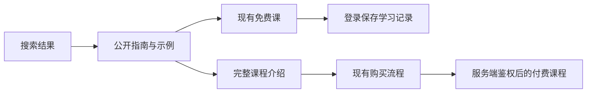

# Tradely SEO 代码改动计划

状态：仅计划，尚未实施。基于 [SEO 研究](./seo-positioning-2026-09-09.md) 和 2026-09-09 当前代码，基线 HEAD 为 `5bd62bb`。目标站为 Tradely。

## 目标与设计决定

让搜索访客可以直接读懂一个期权问题、操作一个公开示例，再进入免费课程或完整课程。

**设计声明：公开指南由独立的内容目录管理，课程数据继续拥有课程身份与免费入口，服务端继续拥有课程访问、评分和学习记录；SEO 元数据与索引清单由同一套页面规则生成。**

本计划采用以下默认选择，实施时无需重新讨论常规细节：

- canonical 主机采用研究时实际最终落地的 `https://www.tradely.ai`；发布前复核重定向，避免和平台域名设置冲突。
- 首批新增 `/guides`、`/guides/gamma-exposure`、`/guides/open-interest-vs-volume`、`/guides/iv-crush`。
- 指南是完整公开的知识页，`/learn/*` 是按顺序学习、练习和保存进度的课程页。两者各自提供不同内容，不复制正文，不做跨意图 canonical。
- 现有 3 节免费课及全部付费权益保持现有定义。公开演示使用单独编写的公开数据，不开放付费题库。
- 首期以英文搜索为目标，保持现有中文 UI 能力；暂不引入 `/zh` 路由或声称已有中文独立 SEO。
- 使用现有 TanStack Start、React、Markdown、Vitest；不引入 CMS、新数据库或新的定价引擎。

## 已完成部分与当前缺口

| 项目 | 当前代码事实 | 计划处理 |
|---|---|---|
| 免费入口 | `fb2ddab` 已增加 `getFreeLessons()`，首页、页脚、课程页已使用，文案也已改正 | 验证当前代码及发布结果，不重复实现 |
| 匿名免费练习 | `preview-learning.server.ts` 只允许 `access === "preview"`；重算有界动作历史，不写账户记录 | 保留该边界；公开指南不调用付费课 ID |
| 课程正文 | `lesson.server.ts` 在访问被拒绝时返回 `body: null`、`learning: null` | 为获客新增指南；不直接移除鉴权 |
| SEO | 多个 route 硬编码非 www canonical；课程描述继承根描述；robots/sitemap 为静态文件 | 统一生成规则并消除静态清单漂移 |
| 统计 | 已有类型化课程/购买事件；`PreviewLearning` 未调用这些统计事件 | 新增公开指南漏斗；免费预览事件独立命名，避免污染已登录课程事件 |
| 内容 | 已有 GEX、OI、Greeks 教学材料；没有独立 IV crush 课程或完整期权定价模型 | GEX/OI 复用纯计算规则，公开内容另行编写；IV crush 先做经过验证的有限情景 |

工作区目前还有 analytics、consent、legal、i18n 等未提交工作。实施开始时重新查看状态，在其最新版本上集成；每个提交只包含本任务拥有的改动，不暂存、覆盖或回退其他工作。

## 改动 1：统一 URL、元数据与索引规则

**优先级 P0；第一份实现提交。**

新增：

- `apps/web/src/seo/site.ts`：站点名称、正式 origin、内部路径到 canonical URL 的纯函数。它只管理公开 SEO URL，不改认证回调、媒体签名或支付跳转配置。
- `apps/web/src/seo/pages.ts`：页面类型、索引策略、title/description/OG/Twitter 元数据生成；导出 sitemap 所用的 indexable 页面清单。
- `/sitemap.xml` 与 `/robots.txt` 的 TanStack 服务路由，建议文件 `routes/sitemap[.]xml.ts`、`routes/robots[.]txt.ts`，通过路由生成器确认命名。使用已有 `server.handlers.GET` 形式返回 XML/文本。

修改：

- `routes/__root.tsx`：保留公共 head 默认值，路由生成唯一 title、description、canonical，避免多个互相冲突的 robots 标记。
- `routes/index.tsx`、`routes/courses.tradingflow-foundations.tsx`、`routes/learn.$lessonSlug.tsx`、`routes/pricing.tsx` 和法律页面：接入统一规则。
- 删除旧 `public/sitemap.xml`、`public/robots.txt`，避免静态文件覆盖新服务路由。

索引政策必须明确：

| 页面 | 初始政策 |
|---|---|
| 首页、课程总览、价格、内容完整的公开指南、现有免费课 | index，自引用 canonical，加入 sitemap |
| 匿名只能看到简短介绍的付费课 | 初始 noindex,follow，保留直接访问与导航；暂不加入 sitemap |
| 有充分独立公开介绍的付费课 | 后续内容完成后再明确开放索引，不因“共 36 课”自动入表 |
| 登录、内部工具页面、无效 slug | 保留或补齐 noindex；无效页面返回实际 404 |
| 隐私、条款、Cookie、风险说明 | 保持可访问与有效 canonical，通常无需作为搜索获客页列入 sitemap |

这修正了研究中的“少列 25 个课程地址”问题：目标是让索引清单与公开内容政策一致，而非机械把 36 个课程外壳全部提交。`lastmod` 只使用真实内容修改日期，不填每次构建时间。

验收：正式 canonical 直接返回 200；sitemap 无重复、无非 www 地址、无 noindex/404 页面；指南和免费课禁用 JS 仍有正文；预览部署保留平台访问保护并验证不会意外被索引。元数据符合 [Google canonical 指南](https://developers.google.com/search/docs/crawling-indexing/consolidate-duplicate-urls)与 [sitemap 指南](https://developers.google.com/search/docs/crawling-indexing/sitemaps/build-sitemap)。

## 改动 2：公开指南内容与路由

**优先级 P0；第二份实现提交，依赖改动 1。**

新增：

- `content/guides.ts`：小型、类型化的公开目录，字段为 `slug`、标题、描述、正文、真实更新日期、参考来源、相关课程 ID、演示类型。仅包含明确公开的数据。
- `routes/guides.index.tsx`、`routes/guides.$guideSlug.tsx`：SSR 指南列表和详情；loader 只读取公开目录，不依赖会员或课程进度查询。
- `components/guide-article.tsx`：语义化 article、目录、来源、演示区域、下一步导航。复用现有 Markdown 与基础 UI。

首批内容映射：

| 指南 | 公开页面必须解决的问题 | 连接的课程 |
|---|---|---|
| Gamma Exposure | GEX 单位、净/总量、缺失值、假设持仓符号；为何不能由图表得知真实 dealer 仓位 | `gamma-exposure`、`gamma-regimes` |
| Open Interest vs Volume | 同一合约的成交量与开平仓账本；报告时间；为何 volume > OI 不直接证明新仓 | `session-flow-vs-structure`、`option-strategies` |
| IV Crush | 为什么方向正确但期权价值下降；现价、IV、时间如何共同改变估值 | `implied-realized-volatility`、`theta-vega-rho` |

每篇提供完整回答、一个可复算实例、常见误读、原始参考来源和明确下一步。公开正文不得 import `units/*.server.ts`、`scenarios/*.server.ts` 或序列化付费题库；参考现有课程事实重新编写公开材料。

每篇的主 CTA 为本页公开演示；完成后同时提供“继续免费学习”和准确标注访问要求的相关课程入口。不要把进入 GEX 付费课的链接写成免费练习。

元数据示例：`Gamma Exposure (GEX) Explained with Examples | Tradely`。页面与课程各自自引用 canonical。未知指南 slug 返回 404，不返回“空白成功页”。

验收：匿名 HTML 中出现核心解释、实例、来源与链接；签出/签入用户看到同一公开正文；付费媒体、答案和账户信息不出现在指南响应或客户端 bundle。

## 改动 3：三个轻量公开演示

**优先级 P1；第三份实现提交，依赖改动 2。**

新增 `features/guides/gex-demo.tsx`、`oi-volume-demo.tsx`、`iv-crush-demo.tsx`，以及明确公开的例子数据。每个演示有初始化、操作、解释、检查理解、重置和进入课程的路径。

- **GEX**：复用 `domain/learning/metrics.ts` 中 `gexTotal()` 的缺失值语义；显示净值、总幅度和切片。缺失时显示“已知小计/完整值未知”，不能把 null 当零。若需要 gross 计算，补充纯函数及针对净值抵消的测试。
- **OI / Volume**：复用 `domain/learning/flow-structure.ts` 中可比报告的规则。新增有明确开/平仓身份的公开双账本示例；成交计数和 OI 变化分开计算，不把成交一笔等同 OI 加一。
- **IV Crush**：使用有限、经审校的假设情景表；明确哪些价格是给定值、哪些是计算值。暂不制造全功能期权定价器。不能把小幅 vega 线性近似用于巨幅 IV 变化并声称精确盈亏；若需要任意连续滑块，另立经过验证的定价模型工作项。

三个演示可以复用布局和纯计算，具体交互保持各自实现，不建立带大量模式开关的万能练习引擎。公开演示完成是学习反馈，不生成正式课程成绩、证书或数据库进度。

验收：键盘可完成；移动端无横向溢出；减少动态效果时仍完整可用；JS 尚未运行时静态例子能独立说明问题。只在需要时加载演示代码，不把 Three.js 引入指南默认路径。

## 改动 4：搜索入口、可信信息与内部导航

**优先级 P1；与第二、三份提交一起完成相应页面连接，内容文案可单独提交。**

涉及 `routes/index.tsx`、`components/header.tsx`、`components/footer.tsx`、`components/landing-curriculum.tsx`、`routes/learn.$lessonSlug.tsx`、`i18n/messages.ts`。

- 首页明确表达 options + examples/practice；保留现有视觉与课程结构。Title 建议为 `Learn Options Flow, Greeks & Gamma Exposure | Tradely`。
- 导航增加 Guides；首页展示三个问题入口；指南互相链接到真正相关内容，并由课程页反向链接到相应公开指南。
- 沿用 `getFreeLessons()` 获取免费起点与数量；补充全站 CTA 行为验证，不另造免费 ID 清单。
- 增加可见的来源、内容维护者和更新信息。只有实际存在的作者/审校者才展示其姓名与资格；先用真实组织身份，不能虚构专家背书。
- 首批结构化数据采用与页面可见内容一致的 Organization、BreadcrumbList；适用时使用 Article。JSON-LD 安全序列化，日期和作者必须真实。
- 暂不把 36 节课包装成 36 门独立 Course 来争取富结果。当前只有一个课程体系；Google Course list 有至少三门课程等要求，不承诺课程轮播或星级结果。参考 [Google Course list 文档](https://developers.google.com/search/docs/appearance/structured-data/course?hl=en)。

现有语言选择在客户端 localStorage/navigator 中决定，不能仅加 hreflang 就认为实现双语 SEO。首期指南默认 SSR 英文；若实现中文显示须有完整对应内容。未来单独评估有独立 URL、服务端语言和互相对应 hreflang 的中文版本。

## 改动 5：统计公开内容到课程的转化

**优先级 P1；与首批指南同次发布，依赖当前 analytics 工作完成合并。**

涉及 `analytics/events.ts`、`analytics/events.test.ts`、指南交互组件、必要的导航捕获，以及 `docs/ANALYTICS-SCENARIOS.md`。优先使用现有 `capture()` 和 page view 管道；不重写 provider、consent、PostHog 初始化或 Cookie 策略。

事件提案：

| 事件 | 精确定义 | 允许属性 |
|---|---|---|
| `page_viewed` | 沿用现有定义；route_name 新增 `guides`/`guide` | 沿用现有 path/locale |
| `guide_demo_started` | 用户第一次主动操作，非组件挂载 | guide_id、demo_id、locale |
| `guide_demo_completed` | 完成演示中定义的理解检查，每次演示运行仅一次 | guide_id、demo_id、locale |
| `guide_next_step_clicked` | 点击免费课、相关课或课程总览 | guide_id、destination_kind、lesson_id（可选） |
| `preview_exercise_started/submitted` | 现有匿名免费课服务返回有效开始/结果 | lesson_id、scenario_id、scenario_version；结果仅摘要 |

更新事件类型、名称注册、属性 allowlist 和文档；不得只添加调用而被属性裁剪静默丢弃。匿名预览事件不混入现有 `lesson_exercise_started` 的已登录语义。禁止发送答案、自由文本、原始 referrer 查询或表单内容；同意前发生的操作不在同意后补报。

复用现有登录、购买与权限验证事件观察后续行为；不能把 `course_pass_access_verified` 当作唯一新购买事件，因为它也覆盖恢复/已有权益。收入以现有权威支付记录为准，本任务不改 Stripe 集成。

GSC 用于聚合关键词、展示、点击和品牌过滤；GA/PostHog 用于同意用户的页面与练习行为。不能把 GSC 的非品牌查询精确匹配到单个用户，也不能拿 GSC 点击量直接作为仅同意用户漏斗的分母。若无法可靠识别搜索来源，先报告指南整体漏斗，并注明归因限制。

## 测试与发布验收

计划中的验证，不是本次已执行结果：

1. **元数据/清单测试**：不同页面 title/description/canonical 唯一且匹配；免费课来自课程元数据；sitemap 不包含 noindex/未知 URL；未知 slug 404。断言行为，不把全部文案做脆弱快照。
2. **公开边界测试**：指南匿名返回完整公开内容，付费 scenario/媒体不可获取；现有 `preview-learning.server.test.ts` 的付费 ID 拒绝仍通过；公开演示不会保存或冒充正式进度。
3. **演示计算测试**：符号抵消、缺失和零、不同日期/不同合约不能比较、OI 开平仓案例、IV 情景内部一致性。
4. **统计测试**：同意前无发送；开始/完成去重；注册 allowlist 保留允许字段并丢弃答案；重置与路由切换后的行为正确。
5. **仓库检查**：`pnpm check-types`、`pnpm test`、`pnpm build`，并运行受影响文件的 Biome 和仓库要求的媒体/密钥边界检查。正常生产配置要求保留，不伪造凭证通过构建。
6. **浏览器验证**：桌面/手机、匿名/已登录无权益/有权益、同意/拒绝统计、键盘与减少动态效果。完成搜索落地 → 演示 → 免费课 → 登录保存/课程访问的真实路径。
7. **HTTP/部署验证**：正式 www 与非 www 重定向、HTML 正文、XML/文本 Content-Type、404、canonical、robots；部署后再次复核。GSC 提交和索引检查属于发布后的运营步骤，不以本地构建通过代替。

验证后按上面可独立审查的改动提交本地 Git，排除他人修改；推送与部署按后续明确授权执行。回退时撤回新指南入口与对应 sitemap 条目即可；本方案无数据库迁移、权益变更或历史学习记录改写。

## 执行顺序与首版范围

推荐顺序：**确认免费入口现有修复 → SEO 基础 → 指南路由与 GEX 第一篇 → GEX 演示及统计 → OI / IV 两篇 → 完整浏览器与发布验证**。首篇应包含完整模板与统计，然后另外两篇复用它，避免先搭抽象系统却没有可交付页面。

首版完成标准：3 篇匿名可读指南、3 个可操作的公开例子、有效免费学习路径、统一 canonical/索引政策、可核验的同意后漏斗。暂缓大规模 glossary、ticker 程序化页面、中文独立 URL、完整定价器及高难度泛词扩张。

发布后按研究中的 30/60/90 天门槛迭代；搜索量、KD、曝光和完成率都是优先级与验证依据，不是代码验收能保证的业务结果。
